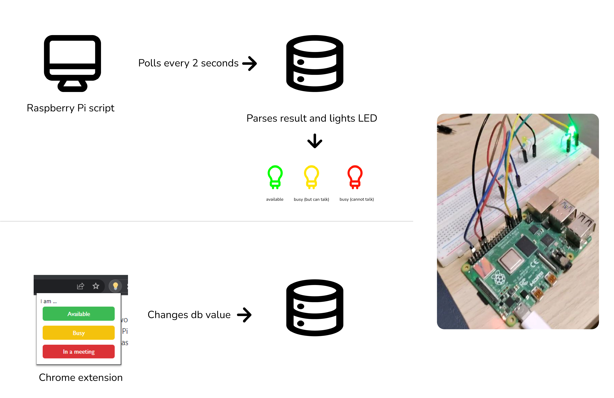

# work-status-meter
A status meter for your work station, powered by a Raspberry Pi hooked to a Firestore database. The Pi script polls the database for changes every 2 seconds.
<p float="center">
  
</p>

## To do 🚀
- Hook a 12x2 LCD to the Pi and display the work status in a text for accessibility.

## What's included 🖥️ 
### Chrome extension
To install the extension, unzip it and go to Chrome settings -> extensions -> load unpacked. 
### Pi Script
This is a Javascript file that can be run on the Raspberry Pi. To do that, cd into the directory and run 
```sh
npm install
node index.js
```
You need to have Node and npm installed on your machine.
